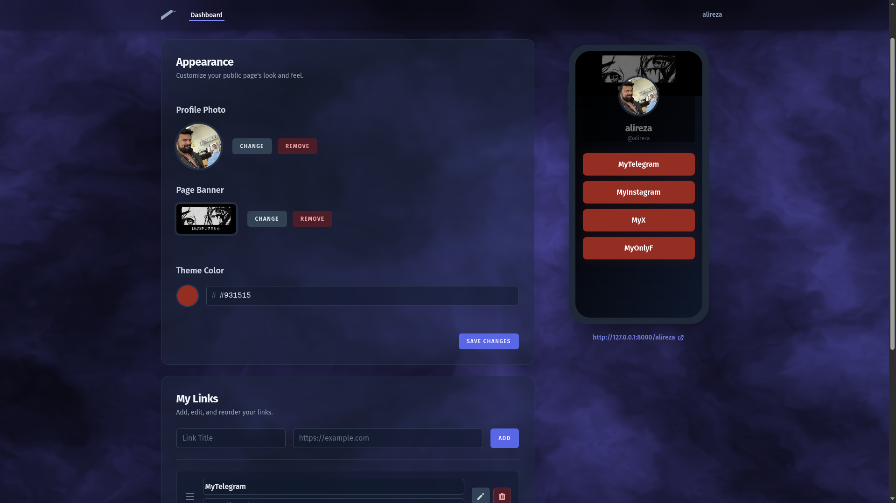

# LinkHub - A Micro-SaaS Platform 🚀

[](https://opensource.org/licenses/MIT)
[](https://www.php.net)
[](https://laravel.com)
[](https://vuejs.org)

A complete Software-as-a-Service (SaaS) platform for building beautiful "link-in-bio" pages, architected with a modern stack using Laravel and Vue.js (via Inertia.js).

**✨ View the Live Demo:** **[linkhub-production-afb2.up.railway.app](https://linkhub-production-afb2.up.railway.app/)**

> **Note:** As this project is deployed on a free-tier hobby plan, the initial load may be slow if the server is in a sleep state. Please allow a few moments for the application to wake up.



---

## 📍 About The Project

LinkHub is a simple, fast, and elegant tool for users who want to centralize their digital identity into a single link. This project serves as a full-stack portfolio piece, showcasing the ability to develop a complete product from architectural design and database schema to a modern, reactive user interface.

## 🌟 Key Features

* **🎨 Advanced Management Dashboard:** A complete user interface for link management, featuring drag & drop reordering.
* **🖼️ Full Customization:** Upload a profile picture, a banner with smart client-side cropping, and choose a custom color theme.
* **💎 World-Class User Experience:** Built with Glassmorphism effects, an interactive 3D "Cosmic Fog" background, and smooth entry animations.
* ** Favicon:** The public page's favicon is automatically set from the user's profile picture.
* **🏗️ Professional Architecture:** Implements the **Service Layer** architecture in the backend for clean, testable, and maintainable code.

## 🛠️ Tech Stack

* **Backend:** Laravel 11
* **Frontend:** Vue.js 3 (Composition API)
* **Architecture:** Inertia.js
* **Database:** MySQL
* **Styling:** Tailwind CSS
* **Key Libraries:** Vanta.js (for the 3D background), VueUse Motion, Vue.Draggable

## 🚀 Getting Started

To get a local copy up and running, follow these simple steps.

### Prerequisites

* PHP >= 8.2
* Composer
* Node.js & NPM
* A MySQL Server

### Installation

1.  **Clone the repo:**
    ```sh
    git clone [https://github.com/aliirezagoharii/linkhub.git](https://github.com/aliirezagoharii/linkhub.git)
    cd linkhub
    ```
2.  **Install PHP dependencies:**
    ```sh
    composer install
    ```
3.  **Install JavaScript dependencies:**
    ```sh
    npm install
    ```
4.  **Setup your environment file:**
    ```sh
    cp .env.example .env
    ```
5.  **Generate an application key:**
    ```sh
    php artisan key:generate
    ```
6.  **Configure your database:**
    Update your database credentials (DB_DATABASE, DB_USERNAME, DB_PASSWORD) in the `.env` file.
7.  **Run the database migrations:**
    ```sh
    php artisan migrate
    ```
8.  **Run the application:**
    ```sh
    npm run dev
    ```
    And in a separate terminal:
    ```sh
    php artisan serve
    ```

## 📜 License

Distributed under the MIT License. See `LICENSE` for more information.

## 📬 Contact

Alireza Gohari - [@Hazrate_Shrek](https://t.me/Hazrate_Shrek)

Project Link: [https://github.com/aliirezagoharii/linkhub](https://github.com/aliirezagoharii/linkhub)
